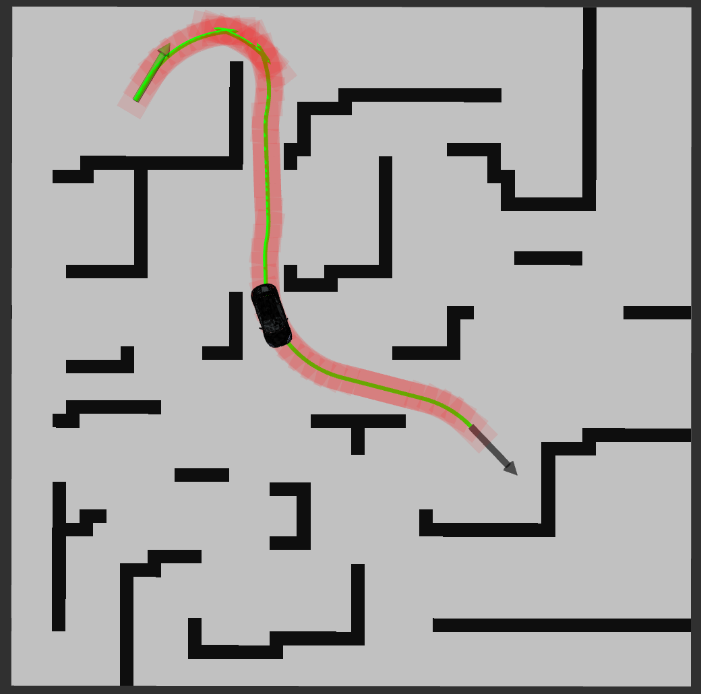
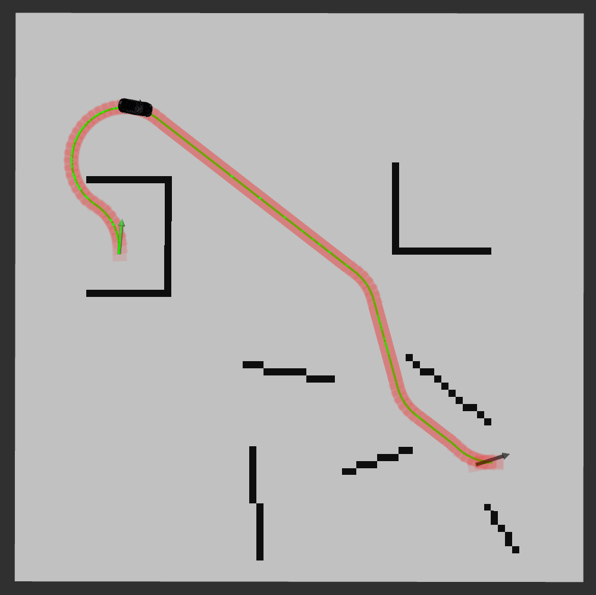
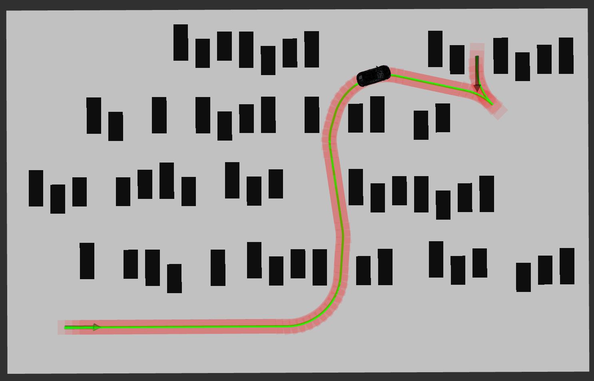
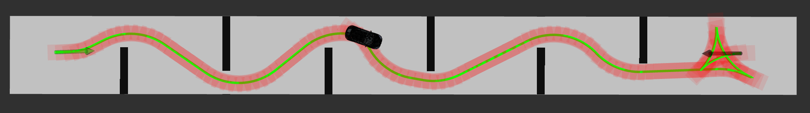

# Hybrid A Star

## 1. Introduce

Hybrid A Star achieved very good results in the DARPA Urban Challenge. And after years of development, the algorithm has been verified to perform very well in parking and some autonomous driving environments without driving rules.

Since the author did not open source the algorithm, it took me weeks to reproduce the algorithm. The final result is close to the speed and effect in the paper.

**Video 0**: [bilibili](https://www.bilibili.com/video/BV1oU4y1d7xt?spm_id_from=333.999.0.0) | [YouTube](https://www.youtube.com/watch?v=MEc1jrEmg0o)

**Video 1**: [bilibili](https://www.bilibili.com/video/BV1qq4y1v77g?spm_id_from=333.999.0.0) | [YouTube](https://www.youtube.com/watch?v=eohHXEIpevg)

**Case 1**



**Case 2**



**Case 3**



**Case 3**



## 2. Prerequisites

(1). **C++11 or C++0x Compiler**

(2). **ROS Melodic**: I'm developing on the melodic version. Using other versions of ROS, it should also work normally

```shell
sudo apt-get install ros-melodic-costmap-*
sudo apt-get install ros-melodic-map-server
sudo apt-get install ros-melodic-tf
```

(3). **Eigen 3**

```shell
sudo apt-get install libeigen3-dev
```

(4).  **glog**

```shell
sudo apt-get install libgoogle-glog-dev
```

## 3. Build Hybrid A Star

```shell
# new folder
mkdir hybrid_a_star_ws/src -p
cd hybrid_a_star_ws/src

# Clone the repository
git clone https://github.com/zm0612/Hybrid_A_Star.git

# Build
cd hybrid_a_star_ws
catkin_make
```

## 4. Run Hybrid A Star

```shell
source devel/setup.bash
roslaunch hybrid_a_star run_hybrid_a_star.launch
```

**The starting point is selected by the `2D Pose Estimate` in rviz, and the end point is selected by the `2D Nav Goal`.**

> I provide multiple maps, you just need to modify the variable image in `hybrid_a_star/maps/map.yaml` file.

> If your start and end points are too close to obstacles, the collision detection mechanism may be triggered and no feasible paths will be searched and displayed

## 5. References

(1). [Practical Search Techniques in Path Planning for Autonomous Driving](https://ai.stanford.edu/~ddolgov/papers/dolgov_gpp_stair08.pdf)

(2). [The Bresenham Line-Drawing Algorithm](https://www.cs.helsinki.fi/group/goa/mallinnus/lines/bresenh.html)

(3). [A simple car](http://planning.cs.uiuc.edu/node658.html)
